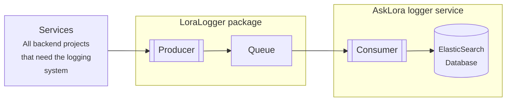

# LORA Logger

This package contains both the customised handler for saving the logs into a elasticsearch database, and a factory for creating customised loggers that can use that handler.

The customised handler will forward the logs to an existing logging service through our own celery service. This logging service will handle the logs and input them into the database. This is done to unionise the logs into a single database.

## Diagram



## How to use

Currently, this package exports a logging handler. Loggers with this handler will be automatically send the records to the elasticsearch server set using the environment variable.

### Package installation

there are two ways to install this pacakge

- install the package locally. first, build the project:
  ```bash
  poetry build
  ```
  then you can install using pip
  ```bash
  pip install /path/to/logger/dist/loralogger-0.2.4-py3-none-any.whl
  ```
- Install the package from pip
  ```bash
  pip install loralogger
  ```

### Using this package

First, set these environment variables:

```
# Set amqp backend
AMQP_BROKER=localhost
AMQP_PORT=5672
AMQP_USER=rabbitmq
AMQP_PASSWORD=rabbitmq

# set results backend
REDIS_HOST=localhost
REDIS_PORT=6379
```

Then you can use the logger in two different ways:

1. Use the logger factory

   - import the logger factory

     ```python
     from loralogger import LoraLogger
     ```

   - create a logger instance, the logger name should point to the Elasticsearch index name you want to send the logs into, with the word "-logs" appended to it (this, for instance, will send the logs to `backend-logs` index)

     ```python
     test_logger = LoraLogger.get_logger('backend',  log_to_es=True)  # We need to set this on or it wont send to Elasticsearch
     ```

   - use the logger
     ```python
     test_logger.warning("Careful!")
     ```

2. Use the handler directly to your own logger instance:

   - import the handler

     ```python
     from loralogger import LogToESHandler
     ```

   - initialise logging instance

     ```python
     backend_logger = logging.getLogger("backend")
     ```

   - Create the handler instance, same as the above, the label should point to an existing Elasticsearch index

     ```python
     handler = LogToESHandler(label="backend")
     ```

   - add the handler instance to the logger

     ```python
     backend_logger.addHandler(handler)
     ```

   - Use the logger

     ```python
     backend_logger.info("This is an info")
     ```

# Notes

- if the pip installation fails, check this link https://github.com/celery/librabbitmq/issues/131#issuecomment-661884151
