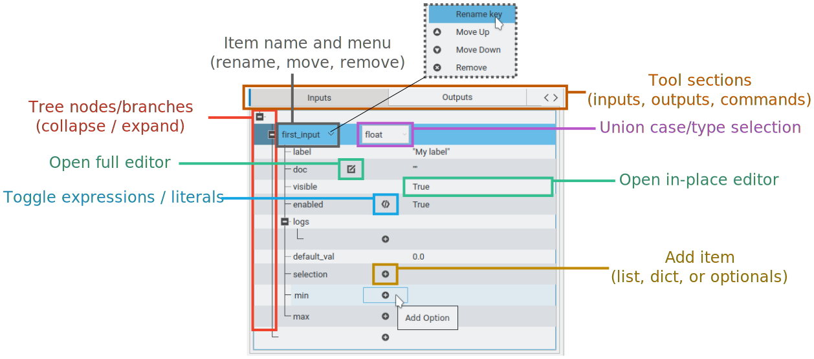
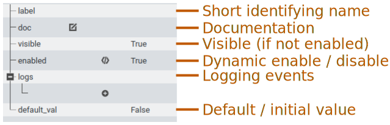
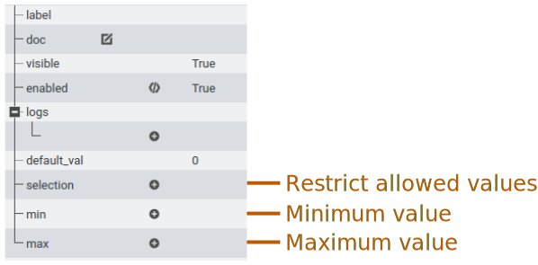
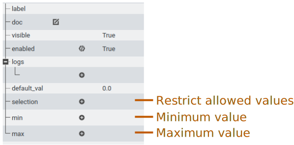
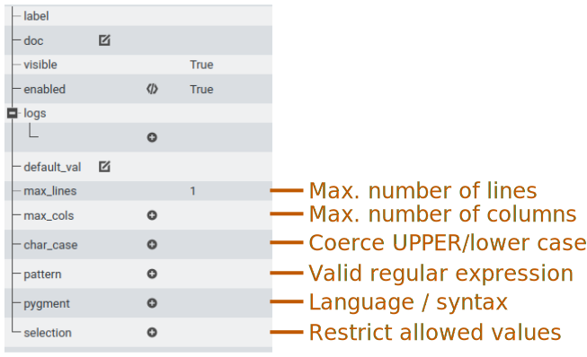
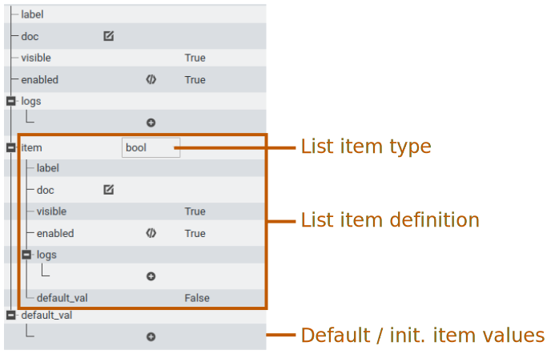
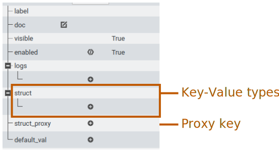
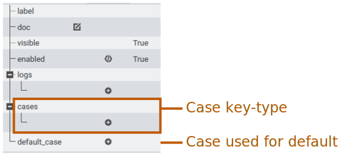

Graphical Editor
================

.. The Nano Workflow Language (NWL) is a specification for defining the steps used
.. to execute an overall workflow.
.. The definition itself is based on a subset of Yaml composed of the base types
.. boolean, integer, float, string, sequence, and mapping.
.. A `Tool` definition encapsulates one step in a workflow and is divided into three
.. primary sections: inputs, outputs, and commands.

.. The inputs section defines the structure and types for input variables to the
.. tool, and is used to validate the input values at run-time.
.. The inputs section may also be used to generate a graphical user interface
.. for creating and editing input files, such as in extensions built for the
.. Galaxy Simulation Builder.

The graphical editor for the Nano Workflow Language is a one-to-one relation to
the elements of the NWL specification.
The NWL `Tool` is divided into three main sections: inputs, outputs, and commands.
Each section is edited by selecting one of the dedicated tabs.
The overall structure of each section is composed of mappings,
sequences, and values represented in a graphical tree.
The tree has a row / column layout, with each row represents a branch
(mapping / sequence) or leaf (value) in the tree as shown in :numref:`schema_tree_edit`.

.. _schema_tree_edit:

  Elements of the graphical NWL tree editor.

The first column contains the tree branches and node names.
If the node itself is editable, such as renaming or moving the node, there
will be a drop-down menu available next to the name that is opened by clicking
the "down" arrow.
Nodes that have fixed names and locations will not have a menu.

.. _move_input:
.. figure:: ./img/nwl_gui/move_input.png
  :figwidth: 60 %
  :align: center

  Node that may be renamed, removed, or moved.

Node values are edited either by clicking the right-most column on the same row
as the node to open an in-place editor, or, for large text, by clicking the
|edit_btn| button
in the second column to open an editor in a dedicated window.
Either editor may be closed with the ``Esc`` key, committing the changes.

If the value has the option of being the result of evaluating an expression, a
|script_btn| button will appear in the third column to convert the node from a literal value
editor to an expression editor (E.G. Python / Cheetah).
When a value has been converted to an expression the button will change color.
Clicking the |script_active_btn| button again will disable the expression editor
and convert the node back to a literal value.

If a node has more than one possible type specification (E.G. int, float, string, etc.),
then a drop-down combo will instead appear in the third column.
If a node may have a variable number of children, the last empty branch under
the node will have a |add_btn| button in the third column to add a new child node.
Move up |move_up_btn|, move down |move_down_btn|, removing |remove_btn|, or renaming the
children added this way may be done through the
drop-down menu next child's name.

Some nodes are optional, and by default do not have any defined value.
Optional values that do not currently have a value will have a "plus" button in
the third column that will define the value.
Optional values that have been defined may be removed from the drop-down menu
next to the node name in the first column.

Evaluated Expressions
---------------------

Expressions are non-literal values such as a Python statement/function or a
Cheetah template string.
The actual value used for the field is determined by evaluating the expression,
such as using the Python interpreter or template engine.

Expressions may use input values, run-time information, command results,
or output values depending on where they appear in the tool definition.
All values accessible in an expression are stored within the underscore ``_``
object available in the expression's local namespace.

Expressions in the inputs section have access only to ``_.data.inputs``.
If the inputs section is hierarchical, then child values may be accessed using
attributes, mapping, or sequence operators.
For example, for the following input file, the integer value ``3`` can be
accessed in any expression as ``_.data.inputs.this_is_it.x``:

.. code:: yaml

  this_is_it:
    x: 3

Note that the interpreter used to evaluate these expressions may have limited
capabilities, since these are intended mainly for graphical editors and not the
run-time environment.
Care should be taken to make the expressions in the inputs section simple,
not attempting to do significant operations, and rely only on builtin methods.
However, none of the expressions in the inputs section have an effect
on the ability to run the tool, and a graphical editor should default to enabling
input fields if evaluating expressions fails.

Expressions outside the inputs section for commands and outputs are evaluated
by the tool runtime engine in a controlled environment, and may make use of
import statements and perform expensive operations.

The tool prolog has acccess to ``_.data.inputs`` and ``_.runtime``.
An intended use of the prolog is to do checking of the runtime environment.
For example, if running the tool requires a particular library or binary program,
a logging event can be used to try to find the library or program, and issue an error message.

The commands section has access to ``_.data.inputs``,
``_.runtime``, and ``_.data.commands`` (only of preceding commands).
Additionally, a command's epilog has access to ``_.command`` that references
the result of the current command.
The outputs section also has access to ``_.data.inputs``,
``_.runtime``, ``_.data.commands`` with all command results.
Finally, the tool epilog has access to all of the above plus ``_.data.outputs``.

Enabled and Visible Fields
--------------------------

Fields named ``enabled`` are used to include dynamic behavior based on
input values.
In a graphical editor for input values, the enabled field can be used to make
some inputs appear optional or dependent upon other input values.
The ``visible`` field controls whether the input should be visible when it is
*not* enabled.
For example, if the input is visible but not enabled, then the input would appear
grayed out.

For logging events and commands the ``enabled`` field controls whether the event
occurs or whether the command should be executed.

Logging Events
--------------

Logging events are an optional mechanism to include additional information,
feedback to the user, and error handling.
These appear as children of ``logs`` for inputs and outputs, and ``prolog`` or ``epilog``
for the tool and commands.
Every log event has three fields: ``level``, ``msg``, and ``enabled``.
The ``enabled`` value controls whether the logging event occurs based on input or
run-time values.
The ``msg`` value is the text string that is to be reported if the log event is enabled.
The ``level`` value marks the severity of the event and is one of ``DEBUG``, ``INFO``,
``WARNING``, ``ERROR``, or ``CRITICAL``.
All enabled events are saved in the run-time results, but are also printed to the
terminal based on the level set for the runtime logger according to the rules in
the Python ``logging`` module.

Logging events specified for inputs may be used by a graphical inputs editor to
provide additional validation or feedback not provided by the NWL specification.

.. _log_event:
.. figure:: ./img/nwl_gui/log_event.png
  :figwidth: 60 %
  :align: center

  Log event.

Events specified in the ``prolog`` of the tool are evaluated at run-time before
the tool executes, while events in the tool's ``epilog`` are evaluated after all
commands and outputs have been successfully evaluated.
Similarly, each command's ``prolog`` is evaluated at run-time before running the command,
and the command ``epilog`` is evaluated after the command has been evaluated.
If a log event is enabled and has a level of ``ERROR`` or ``CRITICAL``, then the tool
will exit without success.
For example, the ``process`` command automatically adds the log event shown in
:numref:`epilog_event` to signal an error based on the return code of the process.

.. _epilog_event:
.. figure:: ./img/nwl_gui/epilog_event.png
  :figwidth: 60 %
  :align: center

  Epilog event.

Inputs
------

All input types have fields for ``label``, ``doc``, ``visible``, ``enabled``,
``logs``, and ``default_val`` (``default_case`` for unions).
The ``label`` is used to provide a short, user-friendly name for the input.
Additional information may be placed in the ``doc`` field, which is used to provide
more contextual information about the purpose of the input.
The ``default_val`` is used as the initial value in the graphical inputs editor,
or to fill in a value when one is not provided in the input file when the tool is run.
Note that all inputs must have a ``default_val`` even if the value is not used at
runtime.

Boolean
.......

.. _edit_bool:

  Boolean input value definition.

Selections
..........

The ``selection`` field appears on the ``int``, ``float``, and ``string`` input
types that can be used when there is a predefined set of allowed values.
In the graphical inputs editor, this will create a drop-down combo with the
selection as the available options instead of the general input editor.
If the label of each option is a non-empty string, then it is used as the
displayed value instead of the literal value.

.. _edit_selection:
.. figure:: ./img/nwl_gui/edit_selection.png
  :figwidth: 50 %
  :align: center

  Selection for an integer input.

Integer
.......

.. _edit_int:

  Integer numeric input value definition.

Float
.....

.. _edit_float:

  Float numeric input value definition.

String
......

.. _edit_string:

  String text input value definition.

List (variable-length sequence)
...............................

The ``list`` input type allows for a variable length list of values.
Each value in the list is validated against the definition in the list's ``item``.
For example, the list definition shown in :numref:`edit_list` would allow a list
of boolean values.

.. _edit_list:

  List sequence input value definition.

Struct ( fixed key-value mapping )
..................................

The ``struct`` input type allows for a mapping of pre-defined key-value pairs
defined by the children in the ``struct`` field.
The ``struct_proxy`` field optionally allows a non-mapping value to be given as
an input value, which is assigned as the value for the given key leaving all other
values given by their respective ``default_val``.
However, note that a ``struct_proxy`` may not be used in a struct that is one
of the cases of a ``union``.

.. _edit_struct:

  Structured key-value mapping input value definition.

Union ( multiple types )
........................

The ``union`` input type allows the input value to be valid against one of
several possible cases.
In order to prevent ambiguity which case a value corresponds to while parsing
the input file, the cases allowed in the union is restricted to the following
combinations:

- Max of one case of type ``bool``.
- Max of one numeric case of either type ``int`` or ``float``.
- Max of one case of type ``string``.
- Max of one case of type ``list``.
- Any number of cases of type ``struct`` without any ``struct_proxy``.
  If there is more than one case of type ``struct``, the input value must be a
  mapping that has a key ``type`` with a value equal to the corresponding case key
  to distinguish which case is to be used.
- No cases of type ``union``.

The union type has a ``default_case`` instead of ``default_val``, which is the
key of the case that will be used to get the initial/default value.
If the ``default_case`` is not given, then the first case is used as the default.

.. _edit_union:

  Multiple input type union definition.

.. |edit_btn| replace:: |edit_btn_light| \| |edit_btn_dark|

.. |script_btn| replace:: |script_btn_light| \| |script_btn_dark|

.. |script_active_btn_dark| image:: img/partis_view_themes/dark/images/icons/script_active.svg
  :width: 16
  :alt: Evaluated/literal button (dark theme)

.. |script_active_btn| replace:: |script_active_btn_light| \| |script_active_btn_dark|

.. |add_btn| replace:: |add_btn_light| \| |add_btn_dark|

.. |remove_btn| replace:: |remove_btn_light| \| |remove_btn_dark|

.. |move_up_btn| replace:: |move_up_btn_light| \| |move_up_btn_dark|

.. |move_down_btn| replace:: |move_down_btn_light| \| |move_down_btn_dark|
